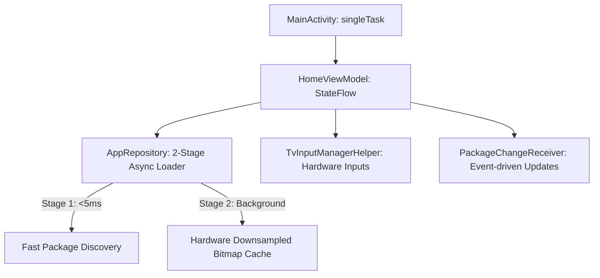

# ⚡ Architecture & Memory Optimization

Zen Launcher achieves an idle RAM footprint of **~29–33 MB PSS**, compared to **180–350 MB** on standard stock Android TV launchers.

---

## 🏗️ Architectural Foundations

---

## 🔑 Core Optimization Strategies

### 1. Two-Stage Asynchronous App Loading
- **Stage 1 (Immediate UI Rendering)**: Package names and labels are fetched asynchronously without blocking main thread. The launcher UI renders in **< 50ms**.
- **Stage 2 (Off-thread Icon Decoding)**: Application icons are decoded in background Coroutines into hardware-friendly `96x96` `ImageBitmap` and cached in a thread-safe `ConcurrentHashMap`.

### 2. In-Hierarchy Modal Overlays
- Android TV 9 (API 28) has known bugs with `androidx.compose.ui.window.Dialog` causing focus drops and click repeat glitches.
- Zen Launcher replaces separate window dialogs with **in-hierarchy composable overlays** (`Box` overlays guarded by `BackHandler`), maintaining consistent focus and eliminating window creation overhead.

### 3. Zero-Polling Package Listener
- Rather than polling installed apps in a background loop, Zen Launcher registers a dynamic `PackageChangeReceiver` listening to `ACTION_PACKAGE_ADDED`, `ACTION_PACKAGE_REMOVED`, and `ACTION_PACKAGE_CHANGED`.
